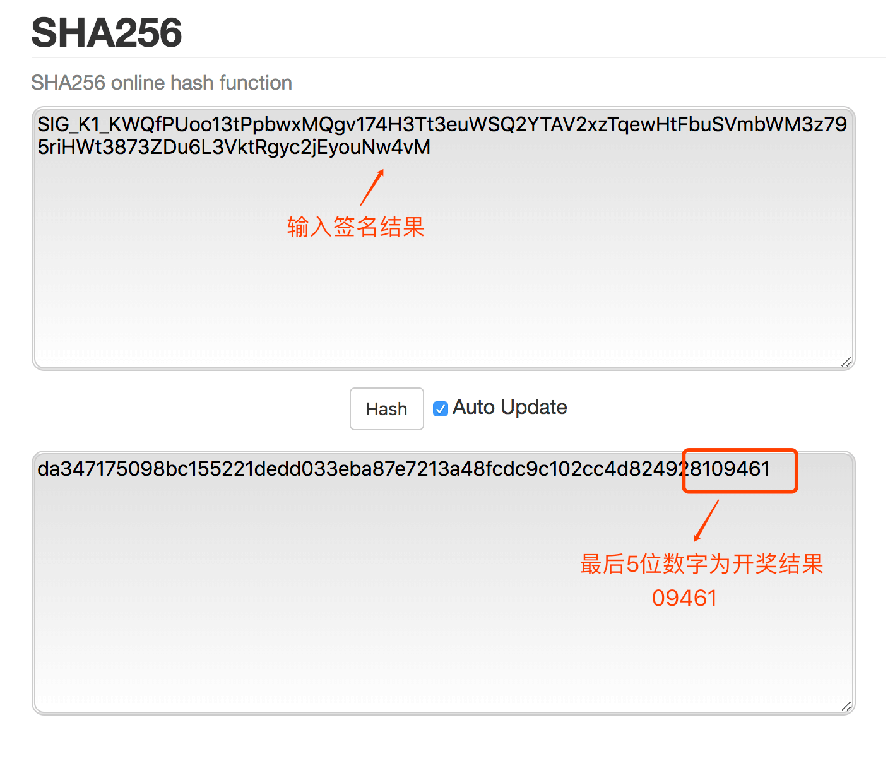

WinPlay.io 公平性验证
---

## WinPlay 开奖方法

* 根据区块 EOS 区块 Hash 作为种子，用提前公布的公私钥对签名
* 对签名结果做 SHA256 得到开奖 HASH
* 取开奖 HASH 最后 5 位数字作为开奖结果
* 可用公式表示如下: 开奖 HASH = sha256(sign(BlockHash))

## 为什么能保证开奖结果是公平的

* 玩家无法作弊：前一分钟的投注，根据下一分钟第一个区块 Hash 开奖
* BP无法作弊：BP在出块的时候无法确定 Hash 对应的开奖结果（因为区块 Hash 只是种子）
* 项目方无法作弊：项目方的公钥是提前公布的，并且保持长期不变，只能用此公钥对应的私钥对区块Hash签名，而区块 Hash 是项目方无法控制的

## 如何验证公平性

我们以这次开奖结果为例:

区块 Hash: 
`0340c044dc6743e9185686416de09b7f25df32b2787293c216ce988a5435d42e`

对区块 Hash 的签名:
`SIG_K1_KWQfPUoo13tPpbwxMQgv174H3Tt3euWSQ2YTAV2xzTqewHtFbuSVmbWM3z795riHWt3873ZDu6L3VktRgyc2jEyouNw4vM`

签名公钥（长期不变）:
`EOS6J5ePXXH4vgfA1XT72qBsKKeH7tJEW3ed7d1Hmwo1BqgeSWZfV`

### 验证区块 Hash 的签名是不是正确

可使用第三方工具: (https://bachvtuan.github.io/eos-key-tools/)[https://bachvtuan.github.io/eos-key-tools/]

### 根据签名获得开奖 Hash

可使用第三方工具: (https://emn178.github.io/online-tools/sha256.html)[https://emn178.github.io/online-tools/sha256.html]

